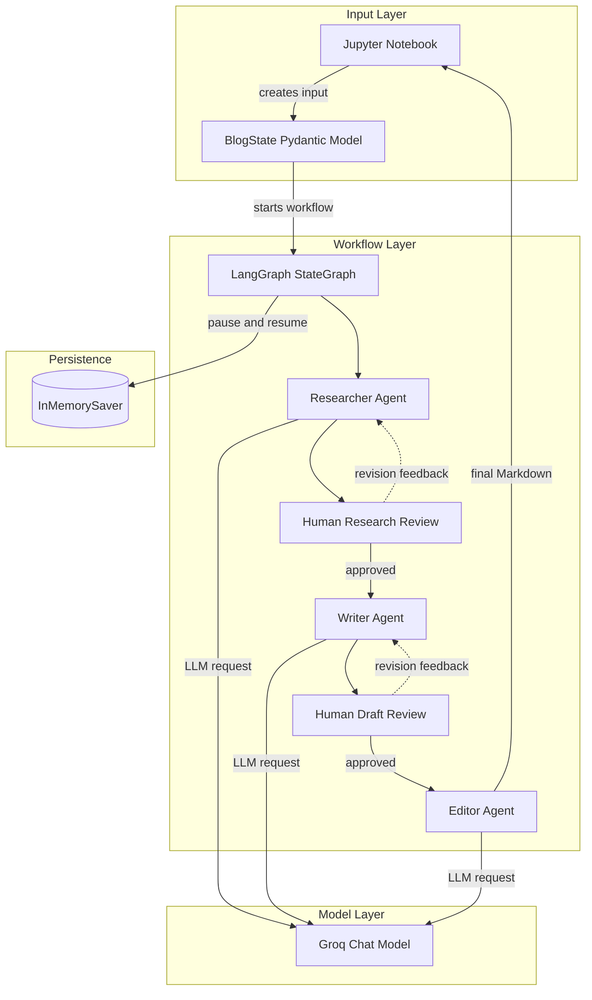
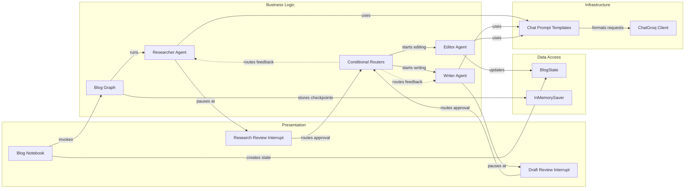

# Architecture Diagram

This document describes the current architecture of the notebook-driven
multi-agent blog generator and the relationships between its workflow components.

## Application Architecture

<!-- mermaid-checked: no \n, no em-dash/en-dash, no {} in labels, subgraphs are id["label"], arrows are -->|"label"|, all subgraphs closed by end, ids unique -->

### Technology Stack Summary

| Layer | Technology | Version | Purpose |
| --- | --- | --- | --- |
| Language | Python | 3.10+ recommended | Application and notebook code |
| Workflow | LangGraph | From `requirements.txt` | State graph, routing, interrupts, and checkpoints |
| LLM integration | LangChain Groq | From `requirements.txt` | Connects agent prompts to the Groq chat model |
| Prompting | LangChain Core | From `requirements.txt` | Defines reusable chat prompt templates |
| State validation | Pydantic | From `requirements.txt` | Defines and validates `BlogState` |
| Interface | Jupyter Notebook | From `requirements.txt` via `ipykernel` | Interactive input, review, and output |

### Data Storage & External Services

The application does not use a database, cache, or message broker. Workflow
state is held in a Pydantic model and checkpointed in memory with
`InMemorySaver`, so it is available only during the running Python process. The
Groq API is the external service used for research, drafting, and editing.

### Key Architectural Decisions

- LangGraph separates workflow orchestration from the agent prompt definitions.
- Human review is modeled as an interrupt so research and drafts can be revised
  without rebuilding the workflow.
- The current implementation uses in-memory checkpointing to keep the notebook
  setup simple; durable persistence would require a different checkpointer.

## Component Relationships

<!-- mermaid-checked: no \n, no em-dash/en-dash, no {} in labels, subgraphs are id["label"], arrows are -->|"label"|, all subgraphs closed by end, ids unique -->

### Component Inventory

| Component | Layer | Type | Responsibility |
| --- | --- | --- | --- |
| Blog Notebook | Presentation | Jupyter interface | Starts the graph, displays review payloads, and resumes interrupted runs. |
| Research Review Interrupt | Presentation | Human-in-the-loop gate | Collects approval or research feedback. |
| Draft Review Interrupt | Presentation | Human-in-the-loop gate | Collects approval or draft feedback. |
| Blog Graph | Business Logic | LangGraph `StateGraph` | Defines node order, edges, interrupts, and workflow completion. |
| Researcher Agent | Business Logic | LangChain chain | Produces a structured research outline. |
| Writer Agent | Business Logic | LangChain chain | Produces or revises the Markdown blog draft. |
| Editor Agent | Business Logic | LangChain chain | Produces the final polished Markdown blog. |
| Conditional Routers | Business Logic | Routing functions | Sends approved work forward and feedback back to the relevant agent. |
| BlogState | Data Access | Pydantic model | Carries user input, generated content, feedback, and revision metadata. |
| InMemorySaver | Data Access | LangGraph checkpointer | Preserves resumable state during the current process. |
| Chat Prompt Templates | Infrastructure | LangChain prompts | Encodes instructions for each agent role. |
| ChatGroq Client | Infrastructure | External LLM client | Sends prompts to the configured Groq model and returns generated content. |
