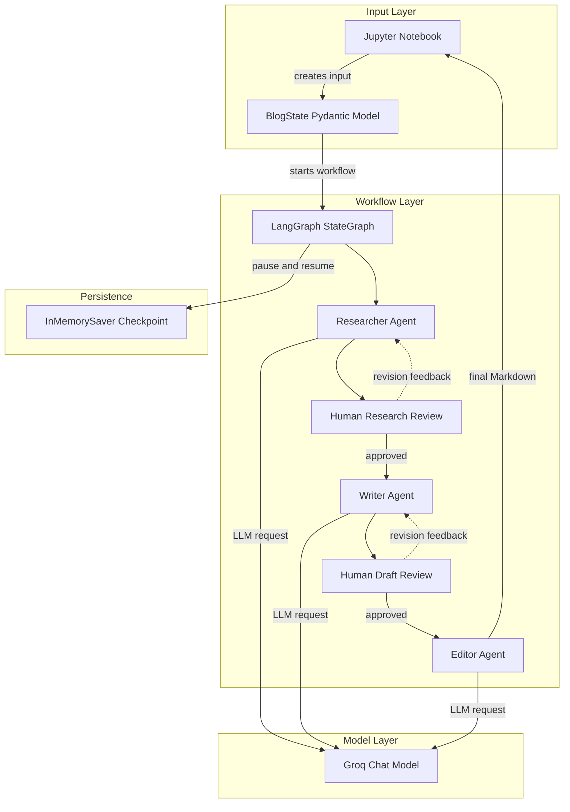
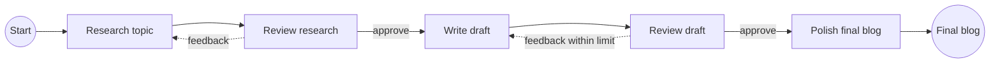

# Multi-Agent Blog Generator

An interactive blog-generation workflow built with LangGraph, LangChain, Groq, and
Pydantic. The workflow researches a topic, pauses for human feedback, writes a
draft, pauses again for review, and then produces a polished final blog post.

The primary entry point is the Jupyter notebook
[`notebooks/blog_notebook.ipynb`](./notebooks/blog_notebook.ipynb). The reusable
workflow implementation lives in [`app/graph.py`](./app/graph.py).

## Features

- Researches a topic for a specified audience.
- Supports human approval or revision feedback after research.
- Generates a Markdown blog draft.
- Supports human approval or revision feedback after drafting.
- Limits draft revisions through a configurable revision limit.
- Runs a final editor pass for grammar, structure, flow, and readability.
- Uses LangGraph interrupts and an in-memory checkpointer to pause and resume the workflow.

## Architecture

<!-- mermaid-checked: no \n, no em-dash/en-dash, no {} in labels, subgraphs are id["label"], arrows are -->|"label"|, all subgraphs closed by end, ids unique -->


### Workflow

<!-- mermaid-checked: no \n, no em-dash/en-dash, no {} in labels, subgraphs are id["label"], arrows are -->|"label"|, all subgraphs closed by end, ids unique -->


### Components

| Component | Location | Responsibility |
| --- | --- | --- |
| `BlogState` | [`app/state.py`](./app/state.py) | Stores topic, audience, research, draft, feedback, and final output. |
| Agent prompts and LLM factory | [`app/agents.py`](./app/agents.py) | Configures the Groq chat model and the researcher, writer, and editor agents. |
| LangGraph workflow | [`app/graph.py`](./app/graph.py) | Connects agent nodes, human interrupts, conditional routing, and checkpointing. |
| Notebook demonstration | [`notebooks/blog_notebook.ipynb`](./notebooks/blog_notebook.ipynb) | Demonstrates invocation, review interrupts, and workflow resumption. |

## Requirements

- Python 3.10 or newer.
- A Groq API key.
- Jupyter Notebook or JupyterLab.

Dependencies are listed in [`requirements.txt`](./requirements.txt).

## Setup

### Windows PowerShell

```powershell
python -m venv venv
.\venv\Scripts\Activate.ps1
python -m pip install --upgrade pip
pip install -r requirements.txt
```

Create a `.env` file in the project root:

```env
GROQ_API_KEY=your_groq_api_key
```

Do not commit `.env` or API keys. The file is excluded by
[`.gitignore`](./.gitignore).

## Run the notebook

From the repository root:

```powershell
jupyter notebook notebooks\blog_notebook.ipynb
```

Run the cells in order. The notebook:

1. Creates a `BlogState` with a topic and audience.
2. Invokes the graph until the research-review interrupt.
3. Displays the research outline for approval or revision.
4. Resumes the graph with `Command(resume=...)`.
5. Displays the draft for approval or revision.
6. Resumes the graph and prints the final edited blog.

The graph is intentionally interactive. When an interrupt is reached, provide
either an approval value such as `approve` or feedback text describing the
requested changes.

## Use the workflow from Python

```python
from app.graph import build_blog_graph
from app.state import BlogState

graph = build_blog_graph()
state = BlogState(
    topic="How to build a consistent writing habit",
    audience="Software developers",
)

config = {"configurable": {"thread_id": "blog-demo"}}
result = graph.invoke(state, config=config)
```

The first invocation pauses at the research-review interrupt. Resume the same
thread with a LangGraph `Command` and a checkpointer configuration:

```python
from langgraph.types import Command

result = graph.invoke(Command(resume="approve"), config=config)
```

The exact interrupt payload and resume calls are demonstrated in the notebook.
Keep the same thread ID while moving through a single workflow run.

## Project structure

```text
.
├── app/
│   ├── agents.py       # Groq model and agent prompts
│   ├── graph.py        # LangGraph workflow and routing
│   └── state.py        # Pydantic workflow state
├── notebooks/
│   └── blog_notebook.ipynb
├── requirements.txt
└── .env                # Local API key file, not committed
```

## Configuration

The default model and temperature are configured in `get_llm()` in
[`app/agents.py`](./app/agents.py). The draft revision limit is configured by
`MAX_REVISION` in [`app/graph.py`](./app/graph.py).

## Notes

- The current checkpoint store is `InMemorySaver`, so workflow state is lost when
  the Python process exits.
- A valid `GROQ_API_KEY` is required before invoking any agent.
- The workflow produces Markdown text; it does not publish directly to a CMS.

## Documentation

The detailed architecture and component relationship diagrams are also available
in [`architecture-diagram.md`](./.github/modernize/assessment/engines/facts/architecture-diagram.md).
